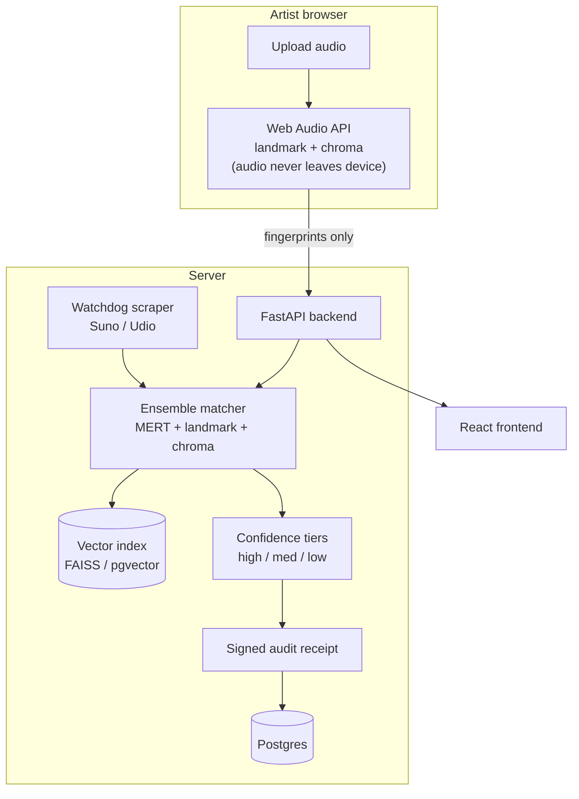

# provenance.fm — architecture

## System overview

## Components
- **Client fingerprinting (Web Audio API):** landmark hash + chromagram computed in-browser; raw audio never uploaded (privacy by design).
- **Ensemble matcher:** MERT embedding (server-side) + landmark hash + chromagram; a match requires **multi-signal agreement** → high precision.
- **Vector index:** FAISS / pgvector for nearest-neighbor candidate lookup.
- **Confidence tiers + signed receipts:** every audit is a forensic claim with a tier and a signed, timestamped transcript.
- **Watchdog scraper:** continuously pulls AI-music platforms (Suno, Udio) and runs them through the matcher.

## Design choices & tradeoffs
- **Precision over recall:** requiring agreement across three independent fingerprints suppresses false positives — critical for evidentiary claims.
- **Client-side hashing:** trades a little matcher power for a strong privacy guarantee (no audio leaves the device).
- **Scale path:** shard the vector index; move the scraper to a **queue** (Kafka-style) with **idempotent**, content-hash-keyed processing; cache hot fingerprints in **Redis**.
